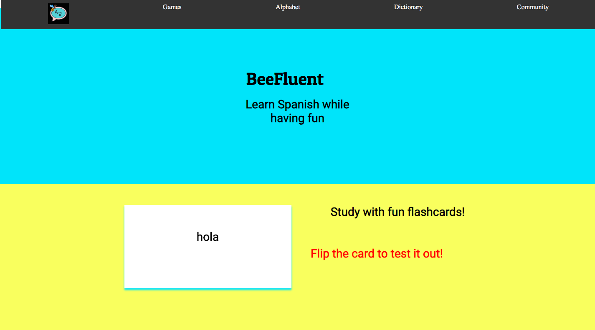

# BeeFluent -  A Spanish Language App

BeeFluent is a product language page for a new Spanish language learning app. Inspired by existing web apps such as Duolingo and Babbel, BeeFluent's goal is to present a prototype for a new language app that is both immediately interactive and leaves the user wanting to learn more.

**Features the BeeFluent App 'would' provide include:**

- Interative Flashcards: Users can immediately flip the card and start learning
- Dictionary/Translator: Look up words and how to use them in the best context
- An online community to keep the language conversation going
- A responsive design: Users can visit the app on their favorite device
- And additional games and resources 

## Tech Stack
BeeFluent was designed and developed with pure 
HTML, CSS, and Vanilla JavaScript. No libraries, no frameworks.

## Additional Notes
Icons for BeeFluent were made available for free thanks to Flaticon and Icons8. Proper attribution to the icon maker(s) is acknowledged in the BeeFluent footer.

## Chingu Project
 BeeFluent was designed and developed by the toucans-team-02 during the Chingu 14 Voyage
